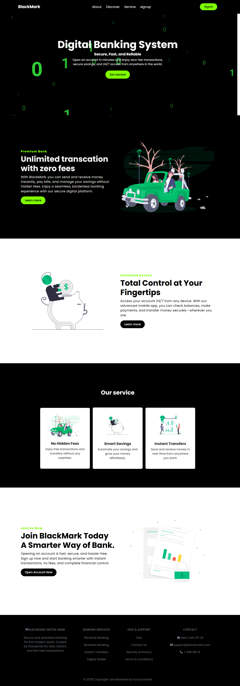

## Introduction
BlackMark Digital Bank is a modern, user-friendly online banking platform that offers seamless and secure banking services. This project is built using **HTML, Bootstrap, and Font Awesome**, ensuring a responsive and professional design.

## Features
- **Secure & Instant Transactions** – Transfer money with zero fees.
- **24/7 Accessibility** – Access your account anytime, anywhere.
- **User-Friendly UI** – Simple and intuitive navigation.
- **Financial Services** – Virtual banking, premium benefits, and expense management.
- **Mobile-Responsive Design** – Works across all devices.

## Technologies Used
- **HTML5** – Structuring the website.
- **Bootstrap 4.6** – Ensuring responsiveness and design consistency.
- **Font Awesome** – Adding icons for a modern look.
- **CSS (External Stylesheet)** – For additional custom styling.

## Output

